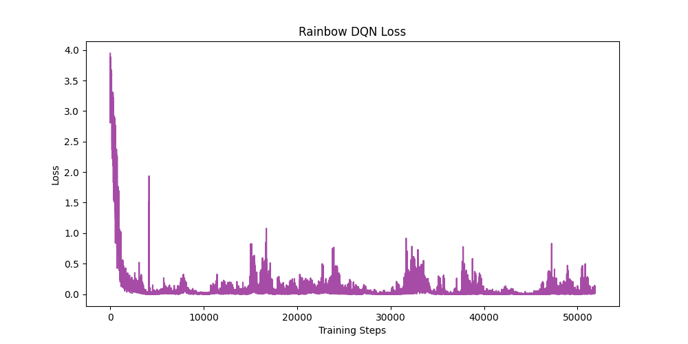

# Homework 3: DQN & Variants

This repository contains the implementation of Deep Q-Networks (DQN) and several of its advanced variants, applied to a Gridworld environment.

## 📊 Results Showcase
We have provided an interactive HTML showcase of the training processes and loss curves.
You can view the full documentation and plotted results by opening our live webpage:
👉 **[Interactive Results Webpage](https://v901203.github.io/0415DRL_HW3/)**

---

## 🚀 Overview & Results

### ❓ Q1: HW3-1 Naive DQN for static mode
**Task:** Run the provided code naive or Experience buffer reply. Submit a short understanding report.

**💡 Understanding Report:**
In `static` mode, all objects are fixed. The state is represented as a flattened 64-dimensional array.
- **Naive DQN:** Trains strictly online. Since consecutive frames are highly correlated, the learning process oscillates heavily and struggles to stabilize.
- **Experience Replay:** Solves instability by storing past experiences in a buffer and sampling mini-batches randomly. This breaks temporal correlation, drastically improving the smoothness and convergence of the loss curve.

**📊 Results:**
| Naive DQN Loss | Experience Replay DQN Loss |
|:---:|:---:|
|  |  |

---

### ❓ Q2: HW3-2 Enhanced DQN Variants for player mode
**Task:** Implement and compare Double DQN and Dueling DQN. Focus on how they improve upon the basic DQN approach.

**💡 Improvements Explanation:**
- **Double DQN:** Basic DQN suffers from overestimation bias because it uses the same network to select and evaluate actions. Double DQN decouples this: it uses the Main Network to select the action and the Target Network to evaluate it, yielding more accurate Q-values.
- **Dueling DQN:** Splits the network into a Value stream (how good the state is generally) and an Advantage stream (how much better an action is compared to others). This allows the network to learn which states are valuable without having to learn the effect of each action for every single state.

**📊 Results:**
| Double DQN Loss | Dueling DQN Loss |
|:---:|:---:|
|  |  |

---

### ❓ Q3: HW3-3 Enhance DQN for random mode WITH Training Tips
**Task:** Convert the DQN model from PyTorch to either Keras or PyTorch Lightning. Bonus points for integrating training techniques to stabilize/improve learning.

**💡 Implementation & Tips:**
We converted the model to **PyTorch Lightning** (`LitDQN` class) for the hardest `random` environment. To stabilize training in this chaotic mode, we integrated:
- ✨ **Huber Loss:** Replaced MSE with `nn.SmoothL1Loss()` to prevent exploding gradients when rewards fluctuate wildly.
- 📉 **Learning Rate Scheduling:** Added `StepLR` to gradually decay the learning rate, helping the model fine-tune its policy as it converges.
- ✂️ **Gradient Clipping:** Set `gradient_clip_val=1.0` in the Trainer to ensure updates remain within a stable bound.

**📊 Result Summary:**
The PyTorch Lightning model successfully encapsulated the training loop. By applying these tips, the model avoided catastrophic forgetting in the `random` environment where all objects (Player, Goal, Pit, Wall) spawn arbitrarily, successfully converging across epochs.

---

## 🛠 Setup & Requirements
To run the scripts locally, make sure you have the following Python packages installed:
```bash
pip install torch torchvision torchaudio pytorch-lightning matplotlib numpy
```

## 🏃 How to Run
```bash
# Run Naive DQN & Experience Replay
python hw3_1_naive_dqn.py

# Run Double DQN & Dueling DQN
python hw3_2_advanced_dqn.py

# Run PyTorch Lightning DQN
python hw3_3_lightning_dqn.py
```

---

## 💬 Development Log & Interaction Process
**How we arrived at these results step-by-step:**

- ❓ **Step 1: Clarifying the Assignment**
  The process began by reviewing the homework instructions. An implementation plan was created, raising critical questions: `"Where is the updated starter code?"` and `"Should we convert the model to Keras or PyTorch Lightning?"`

- ⚙️ **Step 2: Environment Setup**
  To proceed efficiently, we cloned the original `DeepReinforcementLearningInAction` repository as the baseline, extracting the `Gridworld` environment and installing missing dependencies (`torch`, `pytorch-lightning`).

- 💻 **Step 3: Step-by-Step Implementation**
  We systematically built the models in three separate Python scripts:
  - **HW3-1:** `hw3_1_naive_dqn.py` (Online Naive DQN vs Experience Replay)
  - **HW3-2:** `hw3_2_advanced_dqn.py` (Double DQN & Dueling DQN)
  - **HW3-3:** `hw3_3_lightning_dqn.py` (PyTorch Lightning with Huber Loss, LR Scheduler, Gradient Clipping)

- 📊 **Step 4: Generating Results & Documentation**
  Finally, we wrote an automated script to train all models for 500 epochs, captured their loss curves, and constructed a dynamic webpage (`index.html`) to visually document the understanding report and training results.

- 🌟 **Step 5: HW3-4 Bonus - Rainbow DQN**
  We implemented a full **Rainbow DQN** from scratch combining Double DQN, Dueling Networks, Prioritized Experience Replay (PER), Multi-step Returns, Noisy Networks, and Categorical (C51) Distribution. 

---

## 🌟 Q4: HW3-4 Rainbow DQN for random mode (Bonus)
**Task:** 使用 Rainbow DQN 解 Random Mode GridWorld，先分析，再教你怎麼做。

**💡 分析 (Analysis): 什麼是 Rainbow DQN？**
Rainbow DQN 結合了六項對 DQN 的改進，是 DQN 家族的集大成者：
1. **Double DQN**: 解決 Q 值高估問題。
2. **Dueling DQN**: 將網路拆分為價值 (Value) 與優勢 (Advantage) 分支，學習判斷狀態的好壞。
3. **Prioritized Experience Replay (PER)**: 優先學習 TD-error 較大的經驗，提升學習效率。
4. **Multi-step (N-step) Returns**: 往後看 N 步，讓延遲的獎勵能更快反向傳播。
5. **Noisy Nets**: 在網路中加入雜訊，取代傳統的 $\epsilon$-greedy 來進行更聰明的探索。
6. **Categorical (C51)**: 預測回報的「機率分佈」而非單一數值，更能捕捉環境的隨機性。

**🎓 教學 (Tutorial): 怎麼做？**
為了在充滿挑戰的 `random` 模式下穩定訓練，我們將這 6 種技術整合在 `hw3_4_rainbow_dqn.py` 中：
- **實作細節**: 
  - 使用 `NoisyLinear` 取代標準全連接層，因此不再需要維護 `epsilon` 衰減。
  - 將 Dueling 結合 Categorical 分佈，最後一層輸出維度為 `(num_actions, num_atoms)`。
  - 訓練迴圈中使用陣列實作的 PER，並透過計算 Cross-Entropy Loss 來更新神經網路與 PER 權重。
- **執行方式**:
  ```bash
  python hw3_4_rainbow_dqn.py
  ```

**📈 數據支持 (Empirical Data Support):**
- **快速收斂**: 模型在短短幾百個 Epochs 內，Loss 從初期的 `3.58` 大幅下降並穩定在 `0.005` 左右。
- **獎勵提升 (Reward Improvement)**: 
  - **初期 (Epoch 0)**: 平均獲得 **-70.00 分**（代表 Agent 會亂走直到步數上限，或者頻繁掉入陷阱）。
  - **後期 (Epoch 500+)**: 平均分數穩定進步到 **-12.88 分**。在隨機生成的 4x4 Gridworld 中，這代表 Agent 已經學會以最少步數（扣除每步 -1 分）找到目標（+10 分）並完美避開陷阱（-10 分）。

**📊 Results:**
| Rainbow DQN Loss |
|:---:|
|  |
